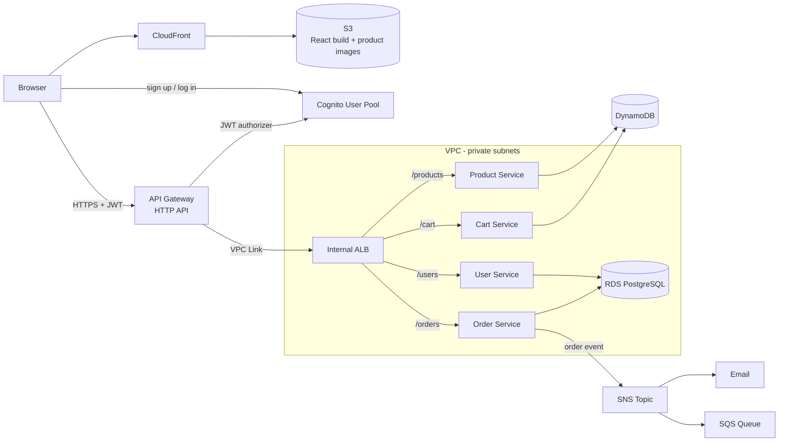

# eCommerce Microservices on AWS

A cloud-native eCommerce application built as four Python microservices behind an API Gateway, with a React frontend, deployed on AWS using ECS Fargate, DynamoDB, RDS PostgreSQL and Cognito.

Users can browse products, sign up and log in, manage a cart, place orders, and receive order notifications.

## Table of Contents

- [Architecture](#architecture)
- [Microservices](#microservices)
- [Tech Stack](#tech-stack)
- [Project Structure](#project-structure)
- [Configuration](#configuration)
- [Deployment](#deployment)
- [Cost](#cost)

## Architecture



How a request flows:

1. The React app is served from S3 through CloudFront.
2. Users authenticate against a Cognito User Pool and receive a JWT.
3. API calls go to an HTTP API Gateway. `GET /products` is public; every other route requires a valid Cognito JWT.
4. API Gateway reaches an internal Application Load Balancer through a VPC Link.
5. The load balancer routes by path to four services running on ECS Fargate in private subnets.
6. Placing an order publishes an event to SNS, which fans out to email and an SQS queue.

Nothing in the backend is exposed to the internet directly: the services, the load balancer and the database all sit in private subnets, with a NAT Gateway for outbound access.

## Microservices

| Service | Port | Data store | Responsibility |
|---|---|---|---|
| Product Service | 8001 | DynamoDB | Product catalog and inventory |
| Cart Service | 8002 | DynamoDB | Per-user shopping cart |
| User Service | 8003 | RDS PostgreSQL | User profiles linked to Cognito identities |
| Order Service | 8004 | RDS PostgreSQL | Order creation and history; publishes order events to SNS |

Each service exposes a `/health` endpoint used by the load balancer.

### API

| Method | Path | Auth | Service |
|---|---|---|---|
| GET | `/products` | Public | Product |
| GET | `/products/{product_id}` | JWT | Product |
| GET | `/cart` | JWT | Cart |
| POST | `/cart/items` | JWT | Cart |
| PUT | `/cart/items/{product_id}` | JWT | Cart |
| DELETE | `/cart/items/{product_id}` | JWT | Cart |
| DELETE | `/cart` | JWT | Cart |
| GET / POST / PUT | `/users/profile` | JWT | User |
| POST | `/orders` | JWT | Order |
| GET | `/orders` | JWT | Order |
| GET | `/orders/{order_id}` | JWT | Order |

## Tech Stack

| Layer | Technology |
|---|---|
| Frontend | React, AWS Amplify (auth UI), hosted on S3 + CloudFront |
| Backend | Python 3.11, FastAPI, Docker |
| Compute | ECS on Fargate, ECR |
| API | API Gateway (HTTP API), VPC Link, internal Application Load Balancer |
| Authentication | Cognito User Pools (JWT) |
| Data | DynamoDB, RDS PostgreSQL |
| Messaging | SNS, SQS |
| Networking | VPC, public and private subnets across two AZs, NAT Gateway |
| Configuration | Systems Manager Parameter Store |
| Observability | CloudWatch Logs |

## Project Structure

```
.
├── services/                    # Backend microservices (FastAPI)
│   ├── product-service/
│   ├── cart-service/
│   ├── user-service/
│   └── order-service/
├── frontend/
│   └── react-app/               # React application
├── data/                        # Sample products, images and load scripts
├── deployment/                  # Step-by-step AWS deployment guides
│   ├── README.md
│   └── module*.md
└── install-prerequisites.sh     # Installs the required local tools
```

## Configuration

No credentials are stored in this repository.

**Frontend.** The React app reads its settings from `frontend/react-app/.env` at build time. Copy the example file and fill in your own values:

```bash
cd frontend/react-app
cp .env.example .env
```

| Variable | Value |
|---|---|
| `REACT_APP_USER_POOL_ID` | Cognito User Pool ID |
| `REACT_APP_USER_POOL_CLIENT_ID` | Cognito App Client ID |
| `REACT_APP_API_BASE_URL` | API Gateway invoke URL |

**Backend.** In AWS, the services read their configuration from Parameter Store under `/ecommerce/dev/`:

| Parameter | Used by |
|---|---|
| `/ecommerce/dev/aws/region` | All services |
| `/ecommerce/dev/db/host` | User, Order |
| `/ecommerce/dev/db/password` | User, Order |
| `/ecommerce/dev/product-service-url` | Order |
| `/ecommerce/dev/cart-service-url` | Order |
| `/ecommerce/dev/user-service-url` | Order |
| `/ecommerce/dev/sns/topic-arn` | Order |

For local runs, each service has a `.env.example` listing the variables it accepts.

## Deployment

The `deployment/` folder walks through the full AWS setup, one module at a time:

| Module | Topic | AWS services |
|---|---|---|
| [0](deployment/module00-prerequisites.md) | Prerequisites | AWS CLI, Docker, Node.js |
| [1](deployment/module01-networking.md) | Networking | VPC, subnets, Internet and NAT gateways, route tables |
| [2](deployment/module02-cognito-authentication.md) | Authentication | Cognito |
| [3](deployment/module03-frontend-deployment.md) | Frontend hosting | S3, CloudFront |
| [4](deployment/module04-data-layer.md) | Data layer | DynamoDB, RDS, Parameter Store |
| [5](deployment/module05-backend-deployment.md) | Backend services | ECR, ECS Fargate, ALB |
| [6](deployment/module06-api-gateway.md) | API layer | API Gateway, VPC Link |
| [7](deployment/module07-frontend-backend-integration.md) | Frontend-backend integration | S3, CloudFront |
| [8](deployment/module08-notification.md) | Notifications | SNS, SQS |
| [9](deployment/module09-custom-domain-and-ssl.md) | Custom domain and SSL (optional) | Route 53, ACM |
| [10](deployment/module10-cleanup.md) | Cleanup | All of the above |

Start with the [deployment overview](deployment/README.md). A full run takes roughly four to five hours.

### Build the frontend

```bash
cd frontend/react-app
npm install
npm run build
aws s3 sync build/ s3://<frontend-bucket> --delete --exclude "images/*"
```

### Build and push a service image

```bash
REGISTRY=<account-id>.dkr.ecr.<region>.amazonaws.com
aws ecr get-login-password | docker login --username AWS --password-stdin $REGISTRY

docker build -t ecommerce/product-service services/product-service
docker tag ecommerce/product-service:latest $REGISTRY/ecommerce/product-service:latest
docker push $REGISTRY/ecommerce/product-service:latest
```

## Cost

The NAT Gateway, RDS instance, load balancer and Fargate tasks are billed by the hour for as long as they exist. Run [Module 10: Cleanup](deployment/module10-cleanup.md) when you are finished to avoid ongoing charges.
